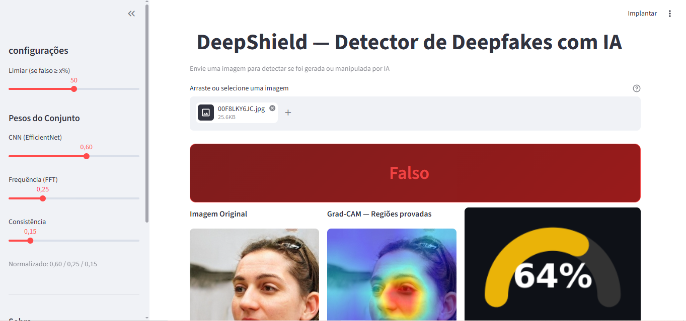

<div align="center">

# 🛡️ DeepShield

**Detector de Deepfakes com Inteligência Artificial**

[](https://python.org)
[](https://pytorch.org)
[](https://streamlit.io)
[](LICENSE)

Detecta imagens geradas por IA combinando **Deep Learning**, **Análise de Frequência** e **Detecção de Artefatos** em um ensemble de alta precisão.



</div>

---

## 📖 O que é

O DeepShield é um sistema de detecção de deepfakes que analisa imagens de rostos para determinar se são reais ou geradas/manipuladas por IA (GANs, Diffusion Models, etc.). Utiliza um ensemble de 3 técnicas complementares para alcançar **99.84% de accuracy**.

## 🔬 Como funciona

O DeepShield combina três abordagens independentes em um score final:

```
                          ┌──────────────────────┐
                          │    Imagem de Input    │
                          └──────────┬───────────┘
                                     │
              ┌──────────────────────┼──────────────────────┐
              ▼                      ▼                      ▼
   ┌─────────────────┐   ┌─────────────────┐   ┌─────────────────┐
   │   🧠 CNN Score   │   │  📊 FFT Score   │   │ 🔍 Consistência │
   │  EfficientNet-B0 │   │  Espectro de    │   │  Laplaciano +   │
   │  Transfer Learn. │   │  Frequência 2D  │   │  Canny + ELA    │
   │   Peso: 60%      │   │   Peso: 25%     │   │   Peso: 15%     │
   └────────┬─────────┘   └────────┬────────┘   └────────┬────────┘
            │                      │                      │
            └──────────────────────┼──────────────────────┘
                                   ▼
                        ┌─────────────────────┐
                        │  Ensemble Score 0-100│
                        │  + Grad-CAM Heatmap  │
                        └─────────────────────┘
```

| Técnica | O que detecta | Como funciona |
|---------|--------------|---------------|
| **CNN** | Padrões visuais aprendidos | EfficientNet-B0 treinado em 100k faces reais/falsas com transfer learning em 2 fases |
| **FFT** | Assinatura espectral de GANs | FFT 2D → perfil radial → detecta atenuação de altas frequências e grid artifacts |
| **Consistência** | Artefatos de edição | Variância do Laplaciano (foco), densidade de bordas (Canny), Error Level Analysis |

## 📊 Resultados

Treinado no dataset **140k Real and Fake Faces** (Kaggle) — 100k imagens de treino:

| Métrica | Valor |
|---------|-------|
| **Accuracy** | 99.84% |
| **F1 Score** | 0.9984 |
| **Precision** | 99.85% |
| **Recall** | 99.83% |

**Estratégia de Transfer Learning:**
- Fase 1 (5 epochs): backbone congelado, lr=1e-3 → convergência rápida do classificador
- Fase 2 (10 epochs): fine-tune últimos 3 blocos, lr=1e-4 → ajuste fino das features

## 🚀 Quick Start

```bash
# 1. Clone e instale
git clone https://github.com/GuizanzotiSB/deepshield.git
cd deepshield
pip install -r requirements.txt

# 2. Rode a interface web
streamlit run app/streamlit_app.py

# 3. Ou use pela CLI
python -m src.ensemble --image sua_foto.jpg
```

## 🏗️ Arquitetura

```
deepshield/
├── src/
│   ├── model.py               # EfficientNet-B0 + classificador customizado
│   ├── dataset.py             # Dataset loader com split 80/20
│   ├── train.py               # Pipeline de treino (2 fases + early stopping)
│   ├── predict.py             # Inferência simples
│   ├── preprocessing.py       # Transforms + augmentation
│   ├── frequency_analysis.py  # FFT 2D + espectro de potência
│   ├── gradcam.py             # Grad-CAM para EfficientNet
│   ├── ensemble.py            # Fusão CNN + FFT + Consistência
│   └── utils.py               # Utilitários
├── app/
│   └── streamlit_app.py       # Interface web completa
├── models/                    # Pesos treinados (.pth)
├── data/                      # Datasets
├── notebooks/
│   └── train_colab.ipynb      # Notebook para treino no Colab com GPU
├── tests/
│   └── smoke_test.py          # Teste rápido do pipeline
├── requirements.txt
└── CLAUDE.md
```

## 🛠️ Tech Stack

| Categoria | Tecnologia |
|-----------|-----------|
|  | Linguagem principal |
|  | Treinamento e inferência |
|  | EfficientNet-B0 pré-treinado |
|  | Processamento de imagem + artefatos |
|  | FFT e computação numérica |
|  | Interface web interativa |
|  | Precision, Recall, F1 |
|  | Gráficos e espectros |

## 🗺️ Roadmap

- [ ] 🎥 Suporte a detecção em vídeo (frame-by-frame + temporal)
- [ ] 🧠 Testar backbones alternativos (EfficientNet-B4, ConvNeXt)
- [ ] 📱 API REST com FastAPI para integração em apps
- [ ] 🌐 Frontend React para versão de produção
- [ ] 🔄 Retreinar com datasets de diffusion models (Stable Diffusion, Midjourney)
- [ ] 📦 Docker container para deploy simplificado
- [ ] ☁️ Deploy na Hugging Face Spaces / Streamlit Cloud
- [ ] 🧪 Testes unitários completos com pytest

## 📄 Licença

Este projeto está sob a licença MIT. Veja [LICENSE](LICENSE) para detalhes.

---

<div align="center">

Feito com 🧠 por [Guilherme Zanzoti](https://github.com/GuizanzotiSB)

</div>
